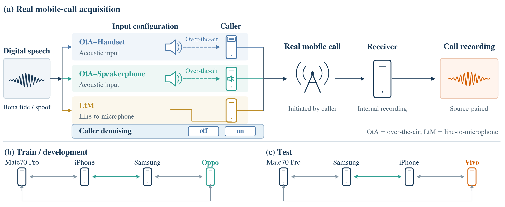
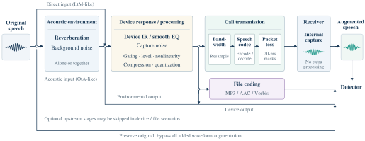

# RealComm

**Audio deepfake detection over real communication channels**

[Project page & audio examples](https://wwwwwli.github.io/RealComm/) · [Manuscript draft](https://wwwwwli.github.io/RealComm/downloads/RealComm.pdf) · [Dataset on Hugging Face](https://huggingface.co/datasets/wli3221134/RealComm) · [Leaderboard · SpoofRadar](https://tefficlabs.com/spoofradar)

RealComm studies how audio deepfake detectors behave when speech passes through a real mobile call. It pairs digital speech with recordings of the same utterances under different input configurations, device routes, and denoising settings, and evaluates simulated augmentation and real-call adaptation.

**Release scope: benchmark only.** The first data release will provide RealCommBench and its paired Digital/test references through manually approved Hugging Face access. RealCommTrain and the digital train/dev partitions are not included. The dataset repository remains private while the benchmark package and access terms are prepared.

## Dataset

The digital source pool contains 2,800 utterances, balanced across bona fide/synthetic speech and English/Mandarin. Synthetic speech covers CosyVoice2, F5-TTS, FlexiVoice, IndexTTS2, MaskGCT, Vevo2, and Minimax.

| Partition | Independent source utterances | Call conditions per source | Call recordings | Release scope |
| --- | ---: | ---: | ---: | --- |
| RealCommTrain / train | 224 | 44 | 9,856 | Not included |
| RealCommTrain / dev | 56 | 44 | 2,464 | Not included |
| RealCommBench / test | 560 | 42 | 23,520 | Included in the benchmark release |

The digital partitions contain 1,792 training, 448 development, and 560 test utterances. RealCommTrain records a subset of the digital training/development sources; RealCommBench records every digital test source. All versions of a source stay in the same partition.

The benchmark release includes the **560 paired digital test utterances**, for a total of **24,080 audio files**. Digital training/development data and RealCommTrain remain unreleased.

Call conditions cover **OtA–Handset**, **OtA–Speakerphone**, and **LtM** (line-to-microphone). OtA denotes over-the-air acoustic injection. Denoising labels distinguish `off`, `on`, and `not_available`; an unavailable switch does not mean denoising is off.

## Main findings

Complete RealComm evaluation results will be published and maintained on [SpoofRadar](https://tefficlabs.com/spoofradar), our unified leaderboard for speech deepfake detection. This README summarizes the manuscript's fixed results; the platform will provide the full evaluation tables and subsequent updates. Model/checkpoint versions, evaluation protocols, and training settings will distinguish zero-shot benchmark entries from adaptation results.

- **Domain shift:** real-call EER rises by 30.91–37.95 percentage points relative to digital speech for the detectors in the main comparison. Acoustic injection is consistently harder than wired injection.
- **RealComm-Aug:** staged waveform augmentation models acoustic propagation, device processing, and call transmission. Augmentation alone lowers call EER for all three adaptation models.
- **Combined adaptation:** simulated augmentation and RealCommTrain together yield the lowest pooled call EER for each of the three models.
- **Signal analysis:** quality deterioration is associated with larger EER increases across recording conditions for the evaluated detectors. High-frequency energy loss alone does not explain condition difficulty.

### Zero-shot benchmark

EER (%) on Digital/test and RealCommBench, lower is better. The same source utterances are evaluated before and after real-call transmission; the detectors receive no RealComm adaptation.

| Model | Digital | Call | Increase (percentage points) |
| --- | ---: | ---: | ---: |
| WavLM-L | 4.64 | 40.00 | +35.36 |
| Whisper | 15.71 | 47.88 | +32.17 |
| AASIST | 7.50 | 40.19 | +32.69 |
| Teffic-Audio | 0.00 | 37.95 | +37.95 |
| DF Arena | 7.86 | 38.77 | +30.91 |

The initial XLSR-SLS evaluation (38.57% digital / 50.31% call EER) is retained in the manuscript’s protocol discussion. Its weak digital baseline limits interpretation of the additional channel effect, so it is not included in the main comparisons.

The manuscript also compares input configuration, denoising, language, and generation system in a unified figure.

### Adaptation results

Pooled RealCommBench EER (%), lower is better. F: frozen baseline; A: simulated augmentation; T: real-call adaptation; A+T: their combination.

| Model | F | A | T | A+T |
| --- | ---: | ---: | ---: | ---: |
| WavLM-L | 40.00 | 38.71 | 35.48 | **34.16** |
| AASIST | 40.19 | 38.49 | 37.96 | **36.90** |
| Teffic-Audio | 37.94 | 34.92 | 23.84 | **22.37** |

These are the manuscript's matched adaptation comparisons. Its separate zero-shot table reports Teffic-Audio at 37.95% under the original inference precision.

T and A+T use RealCommTrain, which is not part of this release. The benchmark package supports evaluating detectors, but does not by itself enable reproduction of those adaptation training runs.

Augmentation alone also improves ASVspoof 2021 LA EER for all three adaptation models. External-test improvements are not uniform: A+T raises In-the-Wild EER by 0.38, 0.78, and 0.85 percentage points for WavLM-L, AASIST, and Teffic-Audio. Figure 8 of the manuscript reports public-test changes on a shared scale.

## RealComm-Aug

RealComm-Aug samples a scenario, then samples operations and parameters within it. Acoustic environment, device response and processing, file coding, and call transmission are organized in signal-flow order. Intermediate outputs cover conventional noise, reverberation, device, and file perturbations; call scenarios combine bandwidth changes, communication codecs, and waveform-based packet-loss simulation. An unchanged-input path is also retained.

Bona fide and synthetic speech share the same augmentation distribution. Simulated call output is passed directly to the detector, without receiver-side acoustic replay. The figure is shared with the manuscript and project page.

## Data access and use

Dataset: [RealComm on Hugging Face](https://huggingface.co/datasets/wli3221134/RealComm)

**Status: benchmark release in preparation.** The repository is currently private. Manual approval is configured, but public access requests and audio downloads are not yet available.

When the release opens, request access with your Hugging Face account. Approved users will download the data through an authenticated session.

- Use this package only for held-out evaluation. Select checkpoints, thresholds, and hyperparameters on independent training/development data, not on the released test set.
- Evaluate Digital/test (560 utterances) and RealCommBench (23,520 recordings) separately. Compute pooled EER from all scores; do not average subgroup EERs.
- Read the supplied manifests, retain source pairing, and use the same inference protocol across comparisons. Input configurations, routes, and denoising labels support optional subgroup analysis.

Download instructions and the release license will be added with the data release. The current manuscript remains a draft; use its latest version for detailed protocols and results.

**Why a benchmark-only release?** RealComm follows a phased release strategy. This release prioritizes standardized evaluation and reproduction of the digital-to-call benchmark results. RealCommTrain, including its development split, is outside the scope of the current release; no release date is announced for those partitions.

## Resources

| Resource | Availability |
| --- | --- |
| [Project page and paired audio examples](https://wwwwwli.github.io/RealComm/) | Available; English/Mandarin, bona fide/synthetic speech, and multiple call configurations |
| [Manuscript draft](https://wwwwwli.github.io/RealComm/downloads/RealComm.pdf) | Available; dataset design, benchmark, quality/spectral analysis, and adaptation |
| [Leaderboard · SpoofRadar](https://tefficlabs.com/spoofradar) | Platform available; complete RealComm evaluation results will be published here |
| [Benchmark dataset](https://huggingface.co/datasets/wli3221134/RealComm) | RealCommBench + Digital/test only; private preparation with manual approval configured |
| RealComm-Aug code and configurations | Not yet included in this repository |
| Evaluation scripts and prediction-file specification | Not yet included in this repository |
| Adapted model checkpoints | Not yet released through this repository |
